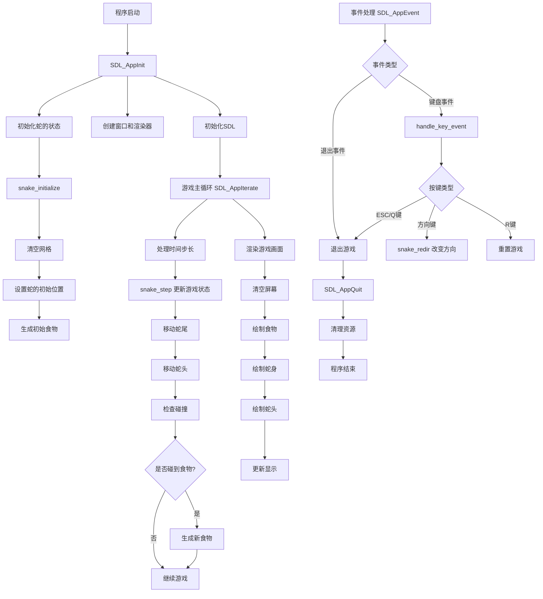

# Snake 游戏流程图

## 流程说明

### 初始化阶段
1. 程序启动后，首先执行 `SDL_AppInit` 进行初始化
2. 初始化 SDL 库，创建窗口和渲染器
3. 通过 `snake_initialize` 初始化蛇的状态
   - 设置初始位置和方向
   - 生成初始食物

### 游戏主循环
1. `SDL_AppIterate` 负责游戏主循环
2. 根据时间步长更新游戏状态
3. `snake_step` 处理蛇的移动逻辑
   - 更新蛇尾位置
   - 更新蛇头位置
   - 处理碰撞检测
   - 处理食物收集
4. 渲染游戏画面

### 事件处理
1. `SDL_AppEvent` 处理用户输入
2. 键盘事件通过 `handle_key_event` 处理
   - 方向键：改变蛇的移动方向
   - R 键：重置游戏
   - ESC/Q 键：退出游戏

### 游戏结束
1. 收到退出事件后执行 `SDL_AppQuit`
2. 清理资源并结束程序